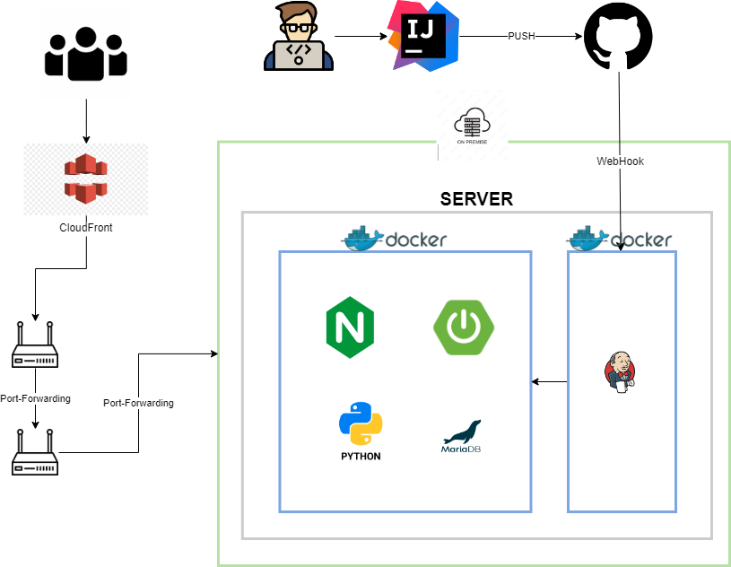

## 폼당 인증 프로젝트


## 목차
[1. 프로젝트 개요](#1-프로젝트-개요) <br>
[2. 프로젝트 구성도](#2-프로젝트-구성도) <br>
[3. 개발 환경 및 기술 스택](#3-개발-환경-및-기술-스택) <br>
[4. 개발 전략](#4-개발-전략) <br>
[5. 실행 방법](#5-실행-방법) <br>
[6. 기능](#6-기능) <br>
[7. 팀원 소개](#7-팀원-소개) <br>
[8. 학습 목표](#8-학습-목표) <br>
[9. 기타 사항](#9-기타-사항) <br>

## 1. 프로젝트 개요

------------
> 다양한 유저에게 Form 제작 및 제출을 제공함으로써 손쉽게 원하는 형태의 Form을 생성하여 공유 할 수 있다. 
> 설문, 퀴즈 등의 다양한 형태로 제공하며 서술형, 객관식, 주관식, 보기 문항들의 다양한 형태로 작성 할 수 있다.
> 만드는 형식에 따라 다양한 컨텐츠가 될 수 있으며, 예시로는 심리 테스트, MBTI, 넌센스 퀴즈 등 들이 있다.
> 특정 고객층 대상이 아닌 다양한 고객을 수용함으로써 대규모 트래픽에 대한 관점으로 개발을 진행 하였다.

## 2. 프로젝트 구성도

------------    



- 인프라 구성은 `네이버 클라우드` 통하여 서버 임대 예정이며 비용 및 서버 스펙에 따라서 다른 클라우드(AWS 등..) 환경으로 변경 할 수 있습니다.
- `CI/CD를 구축`으로 개발부터 배포까지 자동화하여 빠르게 서비스를 런칭하게 구성하였습니다.
- github webhook을 이용하여 `젠킨슨 CI/CD`를 제공할 것 이며, 내부적으로는 `RDS 데이터베이스`를 사용할 것입니다.
- nginx를 통하여 `로드밸런싱 및 인증 처리`를 진행 할 예정입니다.

## 3. 개발 환경 및 기술 스택

------------

### Server
- Java 8
- Spring 2.7.15
- Mysql 8.0.35
- nginx 1.18.0

### Devops
- jenkis 2.4x
- docker 26.0.0
- naver cloud
- github

### Tool
- intelliJ
- ubuntu-20.04

[목차로 이동](#목차)

## 4. 개발 전략

------------

### 배포 전략
> 롤링배포 + 블루/그린 배포 전략 선택 <br>
> TEST 컨테이너를 통하여 이상여부 확인 후, 서비스 전환

<br>

### 브랜치 전략
> Git-flow 전략을 기반으로 main, develop branch 와 feature 보조 브랜치 운용 <br>
> main, develop, feature 브랜치로 나누어 개발
> > main 브랜치: 배포 브랜치 <br>
> > develop 브랜치: 개발 단계에서 git-flow의 master 역할을 하는 브랜치 <br>
> > feature 브랜치: 기능 단위로 독립적인 개발 환경을 위하여 사용

[목차로 이동](#목차)

## 5 실행 방법

------------

### Java

<br>

Install

```
maven build
```

jvm option

```
-Dencryptor.key=${key}
-Dspring.datasource.url=${ENC(url)}
-Dspring.datasource.username=${ENC(username)}
-Dspring.datasource.password=${ENC(password)}
```

Configuration 설정 및 실행
```
Run/Debug Configurations & sprign boot run
```

[목차로 이동](#목차)

<br><br>

## 6. 기능

------------
1. JWT 토큰 발급 및 인증

[목차로 이동](#목차)
## 7. 팀원 소개

------------

<div align="center">


|                         **김범신**                        |
|:--------------------------------------------------------:|
| [ <br/> @beomshinkim]() |

</div>

[목차로 이동](#목차)

## 8. 학습 목표

------------

> 김범신
> - 멀티 모듈 및 MSA 방식에 서비스 운영 (인증서버, API 서버, 협업자 파이썬 프로젝트 등..)
> - 다양한 스트레스 테스트를 통한 대용량 트래픽에 대한 처리 확인

## 9. 기타 사항

------------

- [API규격](http://123.com)
- [히스토리](http://123.com)

[목차로 이동](#목차)

